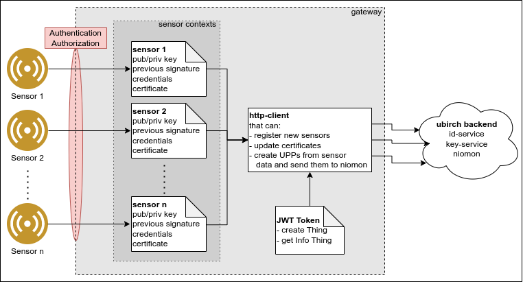
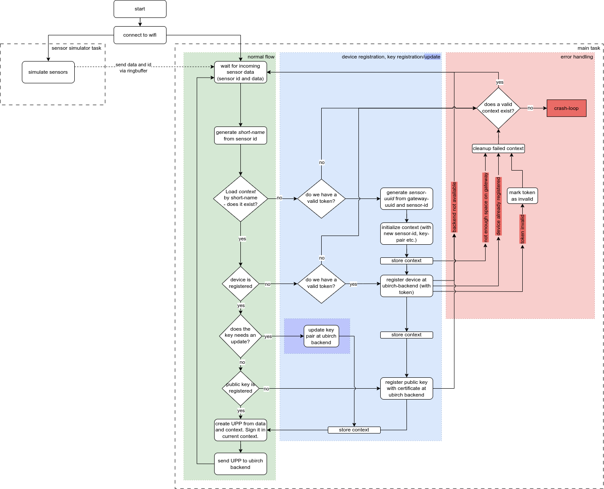

# example-gateway-esp32

[](https://ubirch.de)

# How To implement the example-gateway-esp32 for the ubirch protocol

1. [Basic functionality of the example gateway](#basic-functionality-of-the-example-gateway)
    1. [Ubirch specific functionality](#ubirch-specific-functionality)
    1. [Application flow diagram](#application-flow-diagram)
    1. [JWT Token handling](#jwt-token-handling)
1. [Required packages](#required-packages)
    1. [ESP32-IDF and xtensa toolchain](#esp32-idf-and-xtensa-toolchain)
    1. [example gateway ESP32 application](#example-gateway-esp32-application)
    1. [The submodules](#the-submodules)
1. [Pre-build configuration](#pre-build-configuration)
1. [Build your application](#build-your-application)
    1. [Build and run tests](#build-and-run-tests)
    1. [Store JWT token on gateway memory]()
    1. [Get backup from gateway memory](#get-backup-from-gateway-memory)
1. [UUID Generation](#uuid-generation)

# Basic functionality of the example gateway
The following figure shows a general overview for this example gateway application.


This application is represented by the grey box in the middle (gateway). On the left side there are sensors, which are connected to this gateway. These sensors are simulated inside this application, by the [sensor_simulator_task()](https://github.com/ubirch/example-gateway-esp32/blob/main/main/main.c#L68-L105) and have to be replaced by real sensors. 
>**Note:** The **Authentication/Authorization** (shown in red) between sensors and gateway is not handled by this application and has to be provided by the user, to ensure that only authorized sensors can connect to the gateway.

If an authorized and known sensor sends data to the gateway, the corresponding ID context is loaded, a UPP is created from the data and transmitted to the ubirch backend. This is all handled inside the [main_task()](https://github.com/ubirch/example-gateway-esp32/blob/main/main/main.c#L118-L167).

If an authorized, but unknown sensor sends data to the gateway, a new ID context is automatically generated, the sensor is registered at the UBIRCH backend and credentials for the sensor are aquired, as well as the public key is exchanged. This is all handled by [ubirch_id_context_manage()](https://github.com/ubirch/example-gateway-esp32/blob/main/main/id_manager.c#L50-L210). After the registration, the ID context is stored on the gateway and there is also a UPP created for the data and sent to the UBIRCH backend. Details of the complete program flow are shown in the [application flow diagram](#application-flow-diagram).

The JWT Token is required for the automatic device registration and is described in [JWT Token handling](#jwt-token-handling).

## Ubirch specific functionality
- register new device at the backend, see [ubirch_register_current_id()](https://github.com/ubirch/ubirch-esp32-api-http/blob/master/register_thing.h#L53), used [here](https://github.com/ubirch/example-gateway-esp32/blob/main/main/id_manager.c#L154-L155). **Note:** a valid JWT token is necessary for that. 
- generate keys, see [create_keys()](https://github.com/ubirch/ubirch-esp32-api-http/blob/master/keys.h#L50)
- register keys at the backend, see [register_keys()](https://github.com/ubirch/ubirch-esp32-api-http/blob/master/keys.h#L58)
- store the previous signature (from the last message), see [ubirch_previous_signature_set()](https://github.com/ubirch/ubirch-esp32-key-storage/blob/master/id_handling.h#L199)
- store the public key from the backend, to verify the incoming message replies, see [Pre-build configuration](#pre-build-configuration)
- create a message in msgpack format, according to ubirch-protocol, see [ubirch_message()](https://github.com/ubirch/ubirch-esp32-api-http/blob/master/message.h#L44)
- make a http post request, see [ubirch_send()](https://github.com/ubirch/ubirch-esp32-api-http/blob/master/ubirch_api.h#L58)
- evaluate the message response, see [ubirch_parse_response()](https://github.com/ubirch/ubirch-esp32-api-http/blob/master/response.h#L44)

## Application flow diagram
The following diagram shows the main program flow of this application, where the green box represents the standard flow, with already known sensors, the blue box represents the registration of a new device via JWT token and the red box represents the error handling mechanisms.

 

## JWT Token handling
For the automatic registration of new sensors to the ubirch backend, it is necessary to use a JWT token. For information about how to generate a JWT token, please refer to [Use JWT Token for ...](files/Use%20JWT%20for%20creating%20and%20managing%20things-v3-20230405.pdf). Once you created the token at [console.prod.ubirch.com](console.prod.ubirch.com) you need to copy it and flash it onto the gateway. Afterwards all the new sensor devices will automatically be added to your ubirch account and can be managed. 
>If you do not have a ubirch account, or cannot generate your own JWT Tokens, please contact us at [sales(at)ubirch.com](sales@ubirch.com) and we will take care of that.


# Required packages

The presented ubirch-protocol example implementation on the ESP32 platform is
based on the following prerequisites. So the first steps are to download
and setup the necessary tools and software packages.

## ESP32-IDF and xtensa toolchain

The ESP32 runs on a freeRTOS operating system, customized for the espressif Controllers.
Therefore, the Espressif IoT Development Framework ([ESP-IDF](https://github.com/espressif/esp-idf))
has to be downloaded and set up.

```[bash]
git clone -b v4.3 --recursive https://github.com/espressif/esp-idf.git
```

Make sure you have esp-idf release `v4.3`. The installation of the xtensa toolchain is done
via the `install.{sh, bat}` script and the configuration of your environment by `source`ing
the `export.{sh, bat, ps1, fish}` within the esp-idf.  For detailed instructions follow the
[guide](https://docs.espressif.com/projects/esp-idf/en/v4.2/esp32/get-started/index.html#step-2-get-esp-idf).

> **This example was tested on esp-idf `release/v4.3`.**

## example gateway ESP32 application

The example gateway application [example-gateway-esp32](https://github.com/ubirch/example-gateway-esp32) 
can be used to implement a gateway application on the ESP32, which uses the ubirch-protocol.

```bash
git clone --recursive https://github.com/ubirch/example-gateway-esp32.git
```

> If you have already cloned the example, but do not have the submodules yet,
you can get the submodules with the following commands:

```bash
cd example-gateway-esp32 && \
git submodule update --init --recursive
```

Now the structure on your machine should look like this:
```bash

|-- ESP-IDF
|..
|-- xtensa-toolchain
|..
|-- example-gateway-esp32
        |-- components
                |-- msgpack-c
                |-- ubirch-esp32-api-http
                |-- ubirch-esp32-key-storage
                |-- ubirch-esp32-networking
                |-- ubirch-esp32-ota
                |-- ubirch-esp32-storage
                |-- ubirch-mbed-nacl-cm0
                |-- ubirch-protocol
        |..
```

## The submodules

For the documentation of the herein used submodules, go to the repositories, or the README.md files inside the modules.

This list provides the links to the submodule repositories:

- [msgpack-c](https://github.com/ubirch/msgpack-c)
- [ubirch-esp32-api-http](https://github.com/ubirch/ubirch-esp32-api-http)
- [ubirch-esp32-key-storage](https://github.com/ubirch/ubirch-esp32-key-storage)
- [ubirch-esp32-networking](https://github.com/ubirch/ubirch-esp32-networking)
- [ubirch-esp32-ota](https://github.com/ubirch/ubirch-esp32-ota)
- [ubirch-esp32-storage](https://github.com/ubirch/ubirch-esp32-storage)
- [ubirch-mbed-nacl-cm0](https://github.com/ubirch/ubirch-mbed-nacl-cm0)
- [ubirch-protocol](https://github.com/ubirch/ubirch-protocol)

# Pre-build configuration

>**Note:** in ESP-IDF `release/v4.3` it is possible to use the `idf.py` tool for the most important tasks. For more information, please visit the [ESP-IDF Programming Guide](https://docs.espressif.com/projects/esp-idf/en/release-v4.3/esp32/get-started/index.html).

The URLs for the data, keys and firmware updates, as well as the Wifi credentials can be configured by running:
```bash
$ idf.py menuconfig
```
Navigate to:  
- `UBIRCH` to setup the URL for the firmware update
- `UBIRCH Application` to setup 
   - `wifi SSID`
   - `wifi password`
   - `ubirch-protocol data URL`
   - `ubirch msgpack key server URL`
   - `ubirch key server URL`
   - `ubirch sensor measuring interval (ms)`
   - `ubirch backend public key`
   - `ubirch key lifetime in years`
   - `Enable automatic thing registering`
   - `ubirch register thing URL`
   - `ubirch get info of thing URL` 

# Build your application

To build the application type:

`$ idf.py build`

To cleanup the build directory type:

`$ idf.py clean`

To make sure you start from a clean device type:
>Note: this command will erase the whole content of the flash memory, including your private keys. Make sure to back them up, if you need them later on.

`$ idf.py erase_flash`

To flash the device, type:

`$ idf.py app-flash`

To open the serial output of the application, type:

`$ idf.py monitor`

## Build and run tests

To build and run the test runner, that controls tests that are implemented in the components, you need to have the esp-idf as well as the xtensa toolchain installed, as described above.
Similar to the [Build your application](#build-your-application) section run the following commands to prepare the build (note that you need to change to the `test` directory in the project root):

```bash
$ cd test
$ idf.py build 
$ idf.py flash
```

The testrunner will immediately run the tests after flashing, to get all the outputs start your serial monitor right after flashing, e.g.

```bash
$ idf.py monitor
```

You can re-run single tests by using the interactive test menu which is started right after running the tests.

## Store JWT token on gateway memory
```shell
$ python create_nvs_memory.py --stage demo --out gateway_memory.csv --token <insert your token here>

$ python $IDF_PATH/components/nvs_flash/nvs_partition_generator/nvs_partition_gen.py generate gateway_memory.csv gateway_memory.bin 0x3000

$ parttool.py write_partition --partition-name=nvs --input gateway_memory.bin
```

## Get backup from gateway memory
To backup the whole configuration including all sensor ID contexts use:
```bash
$ parttool.py read_partition --partition-name=nvs --output my_device_config_backup.bin
```
This backup can be very useful, if you develop new features or run tests in between and want to keep and further use the IDs.

>**Note:** If you register the publis key for a device and loose the private key, there is no way to replace or remove the public key, which means that the UUID can not be used anymore.


# UUID Generation
In this example the UUID for the sensor devices is based on UUID version 5, which is a Name-based UUID via SHA1, see [RFC4122](https://www.rfc-editor.org/rfc/rfc4122#section-4.3) for more information.

Since this gateway application connects external sensors, the generated UUID is base on a **namespace**, a **gateway-ID** and a **sensor-ID**. This allows the generation of unique UUIDs for each gateway sensor combination. 
> **Note:** this generated UUID and the corresponding keys and credentials are stored on the Gateway, which means, that if sensor, or gateway are excnhanged, a new UUID needs to be generated.

- to set the **namespace**, go [here](https://github.com/ubirch/example-gateway-esp32/blob/main/main/id_manager.c#L46-L48)
- to set the **gateway-ID**, go [here](https://github.com/ubirch/example-gateway-esp32/blob/main/main/id_manager.c#L89-L98)
- the **sensor-ID** is currently set [here](https://github.com/ubirch/example-gateway-esp32/blob/main/main/main.c#L72-L73) and needs to be adapted by the user.
- the derived sensor UUID is generated [here](https://github.com/ubirch/example-gateway-esp32/blob/main/main/id_manager.c#L100-L109)
- the description of the sensor/thing, for the ubirch console is set [here](https://github.com/ubirch/example-gateway-esp32/blob/main/main/id_manager.c#L149-L153)


